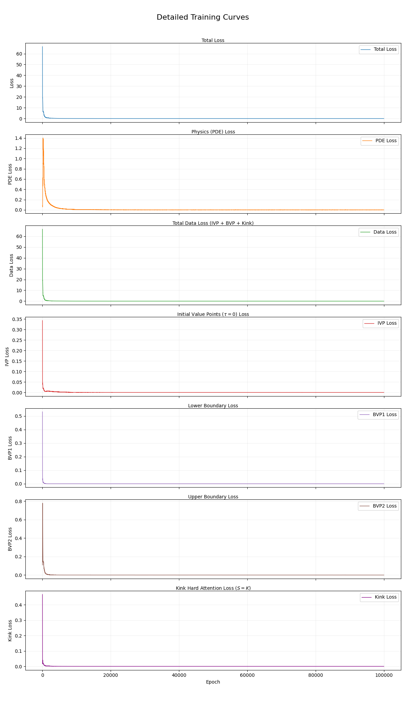
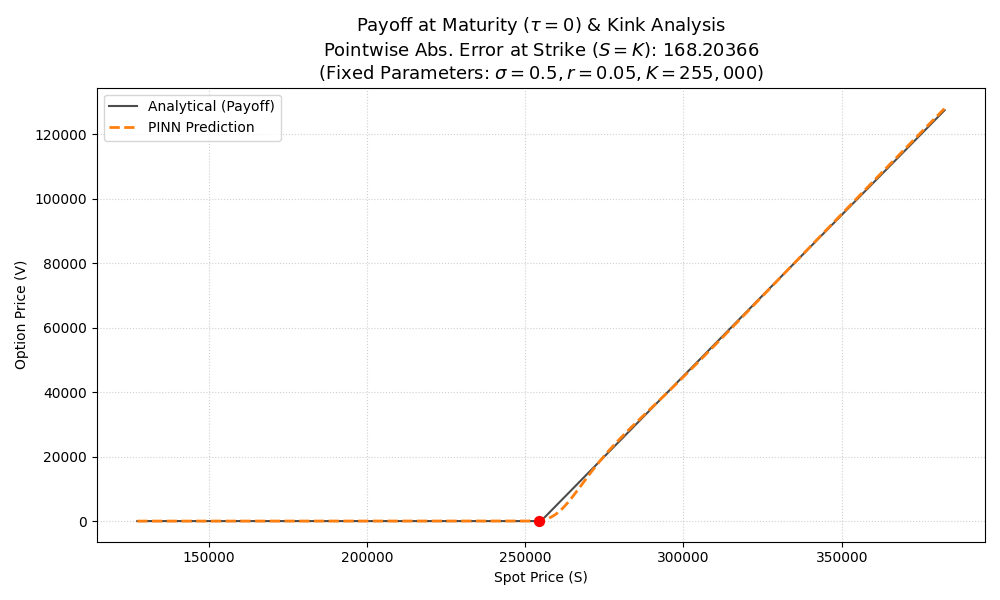
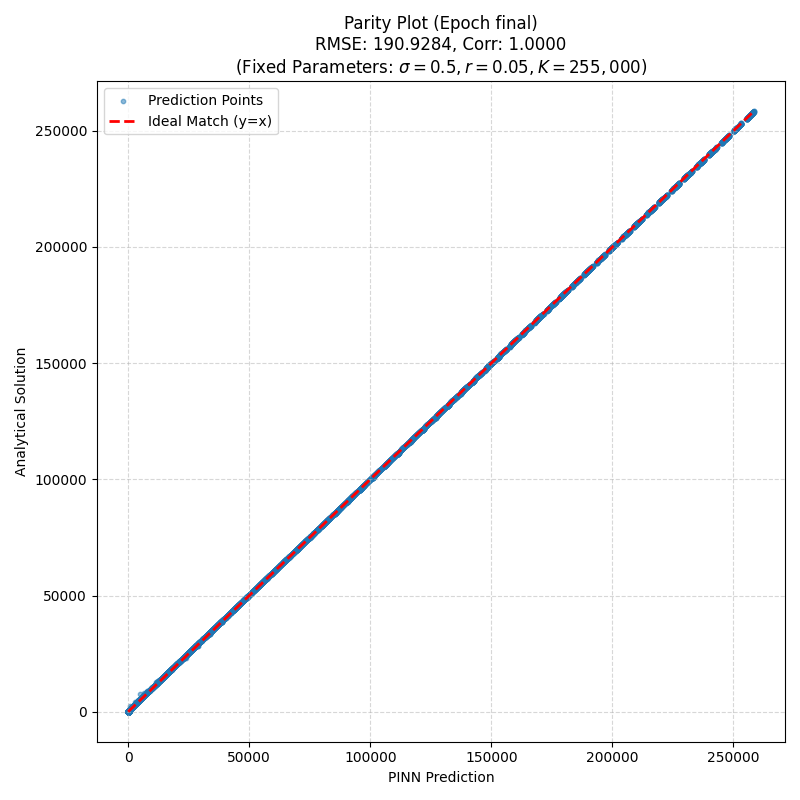
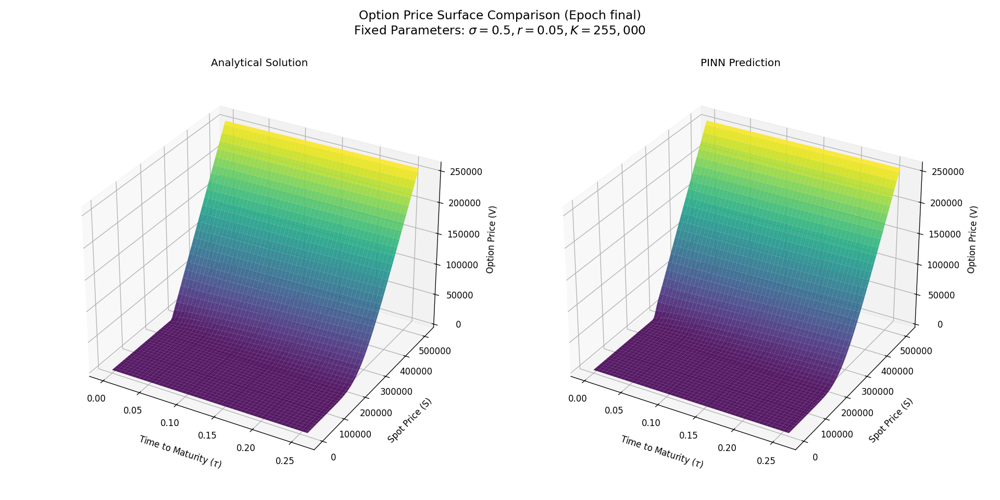
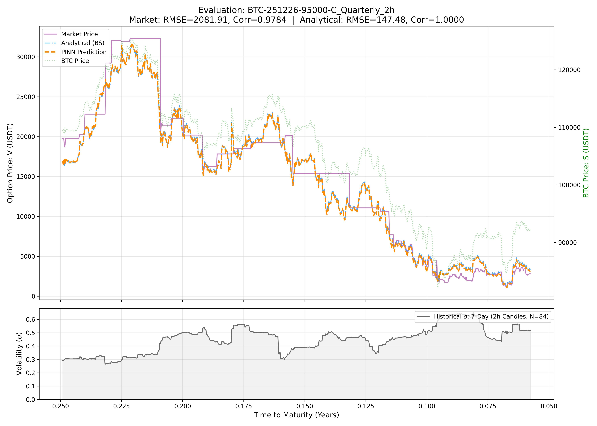
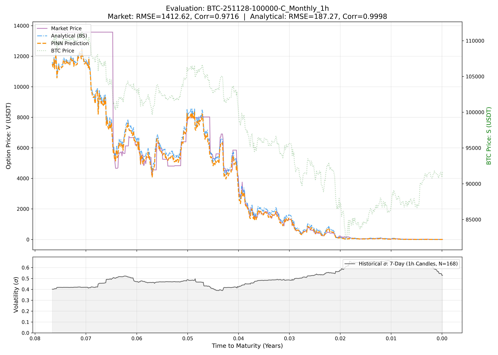
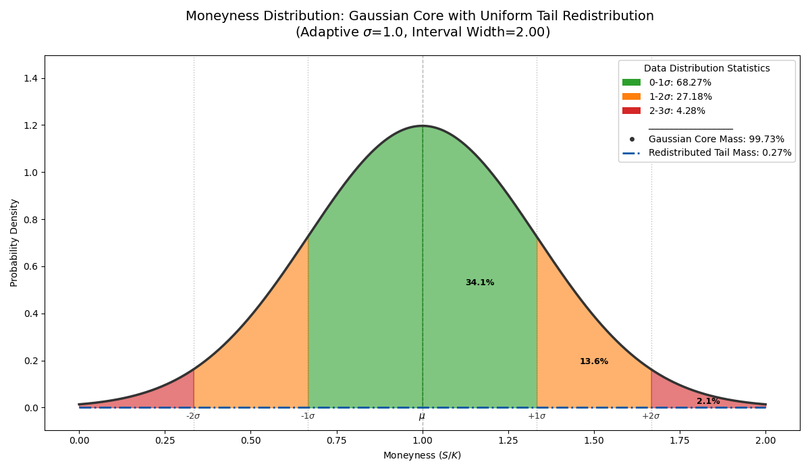
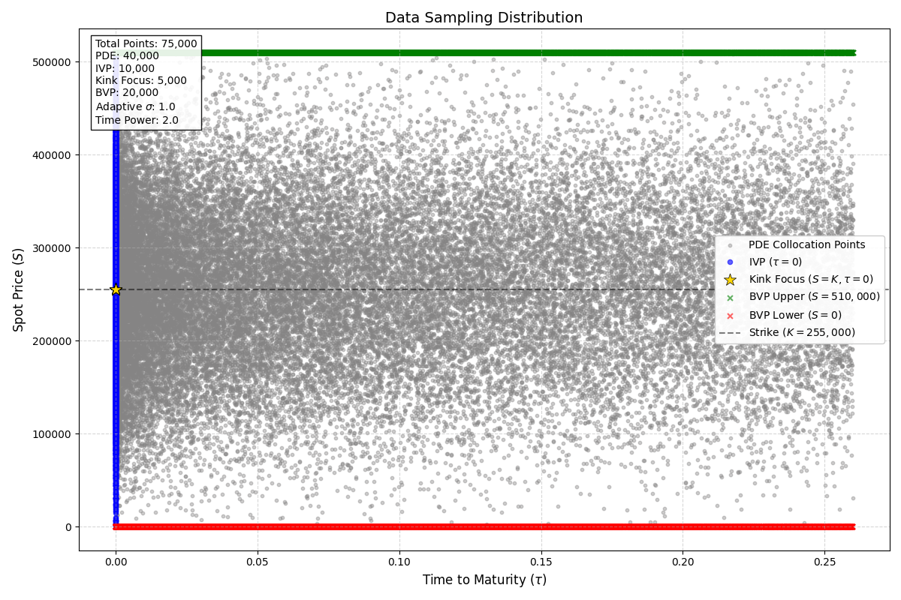
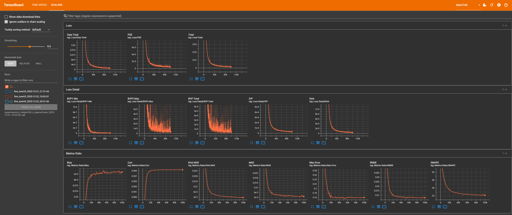

# PINN-BTC: Physics-Informed Neural Networks for Real-time Bitcoin Option Pricing

[](https://github.com/pornchai1889/pinn_btcusdt_option/actions/workflows/ci.yml)
[](https://github.com/pornchai1889/pinn_btcusdt_option/actions/workflows/cd.yml)
[](https://www.python.org/)
[](https://pytorch.org/)
[](https://hub.docker.com/)
[](LICENSE)

>**A universal deep learning solver for European Options, designed to generalize across diverse market regimes via a 5-dimensional input space ($S, K, \tau, r, \sigma$). Featuring a novel mixed-distribution sampling strategy, Kink-Weighted Loss mechanism, and real-time validation against Binance market data.**

## Abstract

This study presents a **universal Physics-Informed Neural Network (PINN)** framework for real-time pricing of European options, designed to generalize across a continuous 5-dimensional input space ($S, K, \tau, r, \sigma$). While traditional deep learning approaches often suffer from overfitting due to reliance on limited historical data, and numerical methods (e.g., Finite Difference) entail high computational costs, our approach leverages the governing **Black-Scholes Partial Differential Equation (PDE)** directly as a regularization mechanism.

**Unlike traditional models limited by finite historical records, this framework is trained on a massive scale of over 5.5 billion physics-compliant stochastic scenarios, effectively covering nearly all theoretical market regimes.** This is achieved via a novel **Mixed-Distribution Sampling Strategy**, which synthesizes Gaussian and Power-law time-distributed samples to eliminate dependency on labeled datasets. Furthermore, we address the gradient discontinuity problem at the strike price through a specialized **Weighted Kink Loss**, enabling the model to capture high-curvature pricing dynamics with superior precision.

Empirical validation was conducted using real-world **Bitcoin (BTC/USDT)** options data retrieved via the Binance API. The results demonstrate that the proposed PINN framework not only aligns with analytical benchmarks but also exhibits robust performance in volatile market conditions. The final model is containerized and deployed via FastAPI, achieving millisecond-latency inference suitable for high-frequency trading and production-grade financial engineering tasks.

## 1. Introduction

Financial derivatives pricing, particularly for cryptocurrency options, presents a unique challenge due to the extreme volatility and non-stationary nature of digital asset markets. Traditional pricing models, such as the **Black-Scholes-Merton (BSM)** framework, rely on rigid assumptions like constant volatility and geometric Brownian motion, which often fail to capture the "fat-tailed" distributions and volatility smiles observed in real-world crypto trading. Conversely, numerical methods like Finite Difference (FDM) or Monte Carlo simulations, while accurate, are computationally expensive and ill-suited for high-frequency trading (HFT) environments that demand millisecond-latency inference.

To bridge this gap, this project introduces a **Physics-Informed Neural Network (PINN)** solver that hybridizes the data-driven power of deep learning with the governing physical laws of financial mathematics. By explicitly embedding the Black-Scholes PDE into the neural network's loss function (as originally proposed by Raissi et al.), we constrain the search space of the model, ensuring that predictions remain theoretically consistent even in regions with sparse training data.

Our approach specifically addresses the limitations of standard deep learning in finance by:
1.  **Eliminating the need for massive labeled datasets:** Using a self-supervised physics loss.
2.  **Resolving the "Strike Price Singularity":** Through a novel **Kink-Weighted Loss** that captures the sharp payoff transitions.
3.  **Enabling Real-time Greeks:** Providing instantaneous sensitivities (Delta, Gamma, Vega) via automatic differentiation, crucial for dynamic hedging strategies.

## 2. Methodology

### 2.1 Governing Dynamics: Black-Scholes PDE

We formulate the option pricing problem effectively as a solution to the **Black-Scholes Partial Differential Equation (PDE)**. To enhance numerical stability and align with the model's inference logic (where options are priced based on remaining duration), we perform a variable transformation from calendar time $t$ to **Time to Maturity** $\tau = T - t$.

The governing dynamics for the option price $V(S, \tau)$ are defined by the linear parabolic PDE:

```math
\mathcal{F}(V) := \frac{\partial V}{\partial \tau} - \left( \frac{1}{2}\sigma^2 S^2 \frac{\partial^2 V}{\partial S^2} + rS \frac{\partial V}{\partial S} - rV \right) = 0
```

Subject to the domain constraints: $\tau \in [0, T]$ and $S \in [0, S_{max}]$.

### 2.2 Initial and Boundary Value Problems (IBVP)

The PDE is solved subject to specific boundary and initial conditions corresponding to European Options. We rigorously define these conditions for both Call and Put options as follows:

#### **Initial Condition (Payoff at $\tau=0$)**

At maturity (time to maturity $\tau=0$), the option price must converge to the intrinsic payoff. This creates a non-differentiable point ("Kink") at the strike price $K$:

```math
V(S, 0) =
\begin{cases} 
\max(S - K, 0) & \text{for Call Option} \\
\max(K - S, 0) & \text{for Put Option}
\end{cases}
```

Note: This singularity ($C^1$ discontinuity) poses a significant challenge for standard gradient-based optimization. We specifically address this in Section 2.4 via a targeted Weighted Kink Loss.

#### **Boundary Conditions (Spatial Extremes)**

We enforce Dirichlet boundary conditions derived from the asymptotic behavior of the asset price $S$:

* **Lower Boundary ($S \to 0$):**
```math
V(S, \tau) =
\begin{cases} 
0 & \text{for Call Option} \\
K e^{-r\tau} & \text{for Put Option}
\end{cases}
```

* **Upper Boundary ($S \to S_{max}$):**
```math
V(S, \tau) =
\begin{cases} 
S - K e^{-r\tau} & \text{for Call Option} \\
0 & \text{for Put Option}
\end{cases}
```

### 2.3 Analytical Benchmark (Exact Solution)
To validate the PINN's accuracy, we compare predictions against the closed-form **Black-Scholes Analytical Solution** ($V_{exact}$), defined as:

```math
\begin{aligned}
V_{call} &= S \cdot \Phi(d_1) - K e^{-r\tau} \cdot \Phi(d_2) \\
V_{put} &= K e^{-r\tau} \cdot \Phi(-d_2) - S \cdot \Phi(-d_1)
\end{aligned}
```

Where $\Phi(\cdot)$ is the cumulative distribution function (CDF) of the standard normal distribution, and:

```math
d_1 = \frac{\ln(S/K) + (r + \frac{\sigma^2}{2})\tau}{\sigma\sqrt{\tau}}, \quad d_2 = d_1 - \sigma\sqrt{\tau}
```

### 2.4 PINN Architecture & Composite Loss Landscape
We approximate the solution $V(S, \tau)$ using a Deep Neural Network $\hat{V}(S, \tau, K, r, \sigma; \theta)$. The network parameters $\theta$ are optimized by minimizing a composite loss function $\mathcal{L}_{total}$ that strictly enforces physical laws and boundary constraints.

A key innovation of this framework is the introduction of a **Weighted Kink Loss** ($\mathcal{L}_{Kink}$), which applies "Hard Attention" to the singularity at the strike price ($S=K, \tau=0$) to resolve gradient vanishing issues common in standard PINNs.

```math
\mathcal{L}_{total} = \lambda_{PDE}\mathcal{L}_{PDE} + \lambda_{IVP}\mathcal{L}_{IVP} + \lambda_{BVP}\mathcal{L}_{BVP} + \lambda_{Kink}\mathcal{L}_{Kink}
```

The individual loss components are defined as Mean Squared Errors (MSE):

1.  **Physics Loss (PDE Residual):** Enforces the Black-Scholes equation on collocation points ($N_{PDE}$).
```math
\mathcal{L}_{PDE} = \frac{1}{N_{PDE}} \sum_{i=1}^{N_{PDE}} \left( \frac{\partial \hat{V}}{\partial \tau} - \left[ \frac{1}{2}\sigma^2 S^2 \frac{\partial^2 \hat{V}}{\partial S^2} + rS \frac{\partial \hat{V}}{\partial S} - r\hat{V} \right] \right)^2
```

2.  **Initial Value Loss (Payoff):** Enforces the payoff structure at maturity ($N_{IVP}$).
```math
\mathcal{L}_{IVP} = \frac{1}{N_{IVP}} \sum_{i=1}^{N_{IVP}} \left( \hat{V}(S_i, 0) - \text{Payoff}(S_i) \right)^2
```

3.  **Boundary Value Loss:** Enforces asymptotic behavior at $S_{min}$ and $S_{max}$ ($N_{BVP}$).
```math
\mathcal{L}_{BVP} = \frac{1}{N_{BVP}} \left[ \sum \left( \hat{V}(S_{min}, \tau) - V_{LB} \right)^2 + \sum \left( \hat{V}(S_{max}, \tau) - V_{UB} \right)^2 \right]
```

4.  **Kink Loss (Hard Attention):** Specifically targets the critical point $S=K$ at $\tau=0$ to sharpen the hinge.
```math
\mathcal{L}_{Kink} = \frac{1}{N_{Kink}} \sum_{j=1}^{N_{Kink}} \left( \hat{V}(K_j, 0) \right)^2
```
Note: For both Call and Put options, the payoff at $S=K$ is exactly 0.

### 2.5 Massive Scale Sampling Strategy (The "Mixed-Distribution" Engine)

A critical advantage of this framework is the elimination of fixed datasets. Instead, we employ a **Mixed-Distribution Generator** that synthesizes training batches on-the-fly during every iteration. This ensures the model is exposed to a continuous and infinite stream of market scenarios.

The sampling strategy is meticulously designed to cover the 5-dimensional input space:
* **Spot Price ($S$):** Log-normal distribution centered around Moneyness.
* **Time to Maturity ($\tau$):** Power-law distribution (with power=2.0) to focus learning density near expiration ($\tau \to 0$), where the option value is most non-linear.
* **Volatility ($\sigma$) & Rate ($r$):** Uniform sampling across wide theoretical regimes.

> **Training Scale:** With a dynamic sampling rate of 55,000 points per epoch across 100,000 epochs, the model absorbs the physics of **5.5 billion unique market states**, ensuring robust generalization far beyond what is possible with static historical datasets.

### 2.6 Experimental Setup & Hyperparameters

The following table summarizes the specific configuration used to train the **Call Option** model, detailing the market domain boundaries, sampling strategies, and hyperparameter settings defined in `config.yaml`.

| Category | Parameter | Value / Range |
| :--- | :--- | :--- |
| **Market Domain** | Spot Price ($S$) | $0 - 1,000,000$ (USDT) |
| | Strike Price ($K$) | $10,000 - 500,000$ (USDT) |
| | Strike Step ($K_{step}$) | $1,000.0$ (Discrete Sampling) |
| | Time to Maturity ($\tau$) | $0 - 0.26$ Years (~3 Months) |
| | Volatility ($\sigma$) | $0.1 - 2.0$ (10% - 200%) |
| | Risk-free Rate ($r$) | $0.0 - 0.15$ (0% - 15%) |
| **Model Architecture** | Network Structure | 4 Layers $\times$ 256 Neurons (Fully Connected) |
| | Activation Functions | Hidden: `Tanh` / Output: `Softplus` |
| | Input Dimension | 5 ($S, K, \tau, r, \sigma$) |
| | Output Dimension | 1 (Option Price $V$) |
| **Sampling Strategy** | Moneyness Range ($S/K$) | $0.0 - 2.0$ |
| | Time Sampling Power | $2.0$ (Focus on $\tau \to 0$) |
| | Adaptive Std Dev | $1.0$ |
| | Batch Sampling | ~10,000 samples/batch (Dynamic Mixed-Distribution) |
| **Training Config** | Total Epochs | 100,000 |
| | Learning Rate | $1 \times 10^{-4}$ (Adam Optimizer) |
| **Loss Weights** | $\lambda_{Kink}$ (Strike Singularity) | **100.0** (Critical Priority) |
| | $\lambda_{IVP}$ (Payoff Condition) | 20.0 |
| | $\lambda_{BVP}$ (Boundary Condition) | 20.0 |
| | $\lambda_{PDE}$ (Physics Residual) | 1.0 |

## 3. Performance & Validation

To demonstrate the robustness of the PINN-BTC framework, we conducted extensive evaluations across three dimensions: convergence stability, analytical accuracy against the Black-Scholes benchmark, and empirical generalization to real-world cryptocurrency market data.

### 3.1 Training Convergence & Loss Landscape
The model was trained for 100,000 epochs using the composite loss function described in the methodology. We monitor the evolution of individual loss components—PDE residual, Boundary conditions (IVP/BVP), and the **Weighted Kink Loss**—to ensure balanced optimization.

* **Convergence Behavior:** The training history reveals that the specialized **Kink Loss** effectively accelerates learning at the critical strike price region ($S=K$), preventing the "smoothing" artifacts typically observed in standard PINNs near non-differentiable points.
* **Loss Visualization:** The figure below illustrates the training dynamics for the **Call Option** model.

<p align="center">
  
</p>

*Figure 3.1*: Log-scale loss history demonstrating the steady decay of physics-informed residuals ($\mathcal{L}_{PDE}$) alongside data-driven constraints for a Call Option.

### 3.2 Analytical Benchmarking (In-Silico Validation)
We benchmarked the trained model against the exact Black-Scholes analytical solution across the entire domain $\tau \in [0, T]$ and $S \in [S_{min}, S_{max}]$.

#### **Pricing Accuracy & Visual Validation**

Visual inspections via `plot_checkpoint_performance` confirm high-fidelity reconstruction of the option pricing surface across the entire domain $\tau \in [0, T]$ and $S \in [S_{min}, S_{max}]$. The validation results are visualized in the figures below:

* **2D Slices & Kink Resolution:** The model perfectly matches the analytical curve at maturity ($\tau=0$), strictly capturing the non-differentiable "Kink" at the strike price ($S=K$) and the convex payoff structure. This validates the efficacy of the hard-attention mechanism.
* **3D Surface Reconstruction:** The PINN generalizes seamlessly across the input space ($S, \tau$), forming a smooth pricing surface that aligns with the Black-Scholes benchmark. The 3D visualization confirms the absence of overfitting spikes, even in extrapolation regions.
* **Statistical Correlation:** The scatter comparison demonstrates a tight 1:1 alignment between the predicted values and the analytical solution across diverse market states, confirming the model's precision.

<p align="center">
  
</p>

*Figure 3.2*: Model prediction at Maturity ($\tau=0$) demonstrating the sharp capture of the non-differentiable "Kink" at the Strike Price ($K=255,000$), validating the weighted-loss mechanism for Call Option.

<p align="center">
  
</p>

*Figure 3.3: Cross-sectional comparison showing the tight alignment between Model Prediction and Analytical Solution for Call Option (Fixed parameters*: $\sigma=0.5, r=0.05, K=255,000$).

<p align="center">
  
</p>

*Figure 3.4*: 3D Surface reconstruction comparing PINN prediction vs. Analytical Solution for Call Option (Fixed parameters: $\sigma=0.5, r=0.05, K=255,000$).

### 3.3 Real-World Market Validation (Binance Data)

Beyond theoretical benchmarks, we validated the model's performance on live **BTC/USDT** options data fetched directly from the **Binance API**.

* **Methodology:** **Historical market inputs** (Spot, Strike, Time to Maturity) were fed into the model. Volatility ($\sigma$) was estimated using a trailing historical volatility window to align the physical model with market realities.
* **Performance Metrics:**
    * **Corr:** $> 0.98$ (Indicating strong correlation with market pricing).
    * **RMSE (Root Mean Square Error):** Evaluated against both **Real Market Prices** and the **Analytical Benchmark** to strictly validate the model's precision in capturing real-world pricing dynamics while remaining consistent with theoretical physics.
* **Visual Validation:** The `eval_real_market` plots illustrate that the PINN predictions tightly track the **historical market close prices** (derived from Binance Klines), validating the **Mixed-Distribution Sampling** strategy's ability to generalize to unseen, noisy real-world data.

<p align="center">
  
</p>

*Figure 3.5*: Validation for **BTC Quarterly Call Option** (Exp: 26 Nov 2025, Strike: 95k) on 2h timeframe. PINN prediction vs. Market Price and Analytical using 7-day historical volatility and fixed $r=0.05$.

<p align="center">
  
</p>

*Figure 3.6: Validation for **BTC Monthly Call Option** (Exp: 28 Dec 2025, Strike: 100k) on 1h timeframe. PINN prediction vs. Market Price and Analytical using 7-day historical volatility and fixed* $r=0.05$.

## 4. Technical Implementation

To transition from theoretical modeling to a production-ready artifact, the framework is engineered with a modular architecture focusing on scalability, security, and inference latency. The implementation pipeline consists of three core stages:

### 4.1 End-to-End Workflow
The project follows a rigorous data-to-deployment pipeline:
1.  **Data Synthesis:** The `DataGenerator` module dynamically creates mixed-distribution training batches (Gaussian + Power-law) on-the-fly, eliminating storage bottlenecks.

<p align="center">
  
</p>

*Figure 4.1*: Pre-training data distribution (Moneyness $S/K$) showcasing the Mixed-Sampling Strategy: a hybrid of Gaussian concentrations (Std Dev visualized) and Uniform dispersion to ensure robust domain coverage.

<p align="center">
  
</p>

*Figure 4.2*: Snapshot of sampled collocation points for a single hypothetical training epoch. The visualization highlights the domain coverage and the density of points generated by the adaptive sampling algorithm.

1.  **Model Training:** Executed via the `Trainer` engine with configurable loss weights and automatic checkpointing to TensorBoard for real-time monitoring.
  
2.  **Validation:** Automated evaluation against both Analytical Solutions (Black-Scholes) and Real-Market Data (Binance) ensures theoretical and practical integrity.

<p align="center">
      
    </p>
    
*Figure 4.3*: Real-time training dashboard via TensorBoard, tracking the composite loss components and gradient histograms to diagnose convergence health.

The dashboard provides comprehensive monitoring of the training dynamics, organized into two primary categories:

* **Loss Landscape:** Tracks the weighted **Total Loss** and its individual components, including **PDE Residuals** (Physics compliance), **Boundary Conditions (IVP/BVP)**, and the critical **Weighted Kink Loss**, enabling real-time diagnosis of optimization stability at the strike price singularity.
* **Validation Metrics:** Monitors generalization performance via standard regression metrics (**RMSE, MAE, SMAPE**) and statistical indicators (**Correlation/R-Score, Bias**), alongside a specialized **Kink MAE** to strictly evaluate pricing accuracy at the non-differentiable point.

### 4.2 High-Performance Inference Engine (API)

The trained models are served via a **FastAPI** microservice, designed for high-throughput financial applications:
* **Asynchronous Architecture:** Utilizing Python's `async/await` paradigm to handle concurrent pricing requests without blocking the computation thread.
* **Input Validation:** Strict type enforcement using **Pydantic** schemas ensures that market parameters (Spot, Strike, Time) fall within the valid training domain before inference.
* **Dual-Model Serving:** The engine simultaneously loads both Call and Put option models, routing requests dynamically based on the instrument type.

### 4.3 Containerization & Deployment

The application is fully containerized using **Docker**, adhering to DevSecOps best practices:
* **Multi-Stage Build:** Separates the build environment from the runtime environment to minimize image size.
* **CPU Optimization:** Explicitly targets PyTorch CPU-only binaries to reduce the container footprint (~60% size reduction) and cost, making it suitable for serverless deployment (e.g., AWS Lambda, Google Cloud Run).
* **Security Hardening:** The container runs as a non-root user (`appuser`) to mitigate privilege escalation risks.

### 4.4 CI/CD Automation

Continuous Integration and Deployment are managed via **GitHub Actions**:
* **Automated Testing:** Unit tests for physics logic and gradient computations are triggered on every push.
* **Linting & Formatting:** Enforces code quality standards using `ruff` or `flake8`.

## 5. Installation & Usage

To facilitate reproducibility and seamless integration into quantitative finance pipelines, we provide deployment methods via **Docker** (recommended for production) and **Local Python environment** (for research/training).

### 5.1 Prerequisites
* **Docker Engine:** Version 20.10+ (Required for containerized deployment).
* **Python:** Version 3.10+ (Required only for local development/retraining).
* **Git:** (Optional) To clone the repository if building from source.

### 5.2 Docker Deployment (Production Ready)

Since the project maintains a **Continuous Deployment (CD)** pipeline, the latest stable model is automatically built and hosted on Docker Hub. You do **not** need to clone the repository to run the inference engine.

**Option A: Pull from Docker Hub (Recommended)**
This is the fastest way to get the PINN solver running with the best pre-trained weights.

**1. Pull the Image:**
```bash
docker pull panglearning1991/pinn-api:latest
```

**2. Initial Setup (Run First Time Only):**
Create and start the container. This command binds the API to port 8000.

```bash
docker run -d -p 8000:8000 --name pinn-cloud-api panglearning1991/pinn-api:latest
```

> **Note:** If you see an error saying *"The container name is already in use"*, it means you have already set up the container. Please skip to step 3 to start it.

**3. Manage the Container (Daily Usage):**
Once the container is created, use these commands to control it instead of running `docker run` again.

* **Check Status:**
```bash
docker ps       # View running containers
docker ps -a    # View all containers (including stopped ones)
```

* **Stop the Service:**
```bash
docker stop pinn-cloud-api
```

* **Start the Service (Resume):**
```bash
docker start pinn-cloud-api
```

**Option B: Build from Source (For Developers)**
Use this method only if you intend to modify the source code, retrain the model, or customize the Dockerfile.

1.  **Build the Image:**

```bash
docker build -t pinn-btc-option .
```

2.  **Run the Local Build:**

```bash
docker run -d -p 8000:8000 --name pinn-container pinn-btc-option
```

### 5.3 Verify the API
Once the container is running (via either option), the interactive documentation (Swagger UI) is available at http://localhost:8000/docs.

You can also send a **batch pricing request** via terminal (using Git Bash or curl):

```bash
curl -X 'POST' \
  'http://localhost:8000/v1/predict' \
  -H 'accept: application/json' \
  -H 'Content-Type: application/json' \
  -d '[
  {
    "spot_price": 96000.0,
    "strike_price": 95000.0,
    "time_to_maturity": 0.15,
    "risk_free_rate": 0.05,
    "volatility": 0.5,
    "option_type": "call",
    "request_id": "scenario-1"
  },
  {
    "spot_price": 96000.0,
    "strike_price": 95000.0,
    "time_to_maturity": 0.15,
    "risk_free_rate": 0.05,
    "volatility": 0.5,
    "option_type": "put",
    "request_id": "scenario-2"
  }
]'
```

### 5.4 Local Development Setup
For researchers intending to modify the network architecture or loss functions:

**1. Clone and Setup:**
```bash
git clone [https://github.com/pornchai1889/pinn_btcusdt_option.git](https://github.com/pornchai1889/pinn_btcusdt_option.git)
cd pinn_btcusdt_option

# Create and activate virtual environment
python -m venv venv
source venv/bin/activate  # On Windows use: venv\Scripts\activate
```

**2. Install Dependencies:** We enforce strict versioning to prevent dependency conflicts.
```bash
pip install -r requirements.txt
```

### 5.5 Operational Commands
**Training the Model**
to train the PINN from scratch using the mixed-distribution sampling strategy:
```bash
python train.py --config configs/train_config.yaml
```

* Outputs: Checkpoints are saved to models/ and logs to runs/ (viewable via TensorBoard).

**Fine-Tuning (Transfer Learning)**
to adapt a pre-trained model to a specific market regime using recent data:
```bash
python finetune.py --base_model models/call/latest.pth --config configs/finetune_config.yaml
```

## 6. Project Structure

The repository is organized into modular components to ensure separation of concerns between the physical modeling, deep learning architecture, and deployment services. This structure facilitates reproducibility and scalability.

```text
pinn_btcusdt_option/
├── .github/workflows/      # CI/CD pipelines for automated testing and deployment
├── configs/                # YAML configuration files for training, fine-tuning, and evaluation
├── models/                 # Directory for storing serialized model artifacts (Call/Put)
├── scripts/                # Standalone scripts for market data acquisition and validation
├── src/                    # Core source code directory
│   ├── api/                # FastAPI inference engine, routes, and Pydantic schemas
│   ├── core/               # Training logic, loss aggregation, and optimization loops
│   ├── data/               # Data synthesis (mixed-sampling) and Binance API connectors
│   ├── models/             # Deep Neural Network architecture definitions
│   ├── physics/            # Black-Scholes PDE formulations and boundary conditions
│   └── utils/              # Helper modules for visualization, metrics, and logging
├── tests/                  # Unit tests ensuring physics consistency and code reliability
├── Dockerfile              # Multi-stage build configuration for containerized deployment
├── train.py                # Main entry point for training the PINN model
├── finetune.py             # Entry point for transfer learning on specific market regimes
└── requirements.txt        # Python dependency specifications
```

## 7. References & Citations

This work builds upon foundational research in scientific machine learning and quantitative finance. We explicitly acknowledge and cite the following pioneering works:

### 7.1 Key Literature
* **[1] Physics-Informed Neural Networks (Original Framework):**
    Raissi, M., Perdikaris, P., & Karniadakis, G. E. (2019). Physics-informed neural networks: A deep learning framework for solving forward and inverse problems involving nonlinear partial differential equations. *Journal of Computational Physics*, 378, 686-707.
* **[2] PINNs for Option Pricing:**
    Dhiman, A., & Hu, Y. (2021). *Physics Informed Neural Network for Option Pricing*. Georgia Institute of Technology, CS7643 Deep Learning Project.
* **[3] Black-Scholes Model:**
    Black, F., & Scholes, M. (1973). The Pricing of Options and Corporate Liabilities. *Journal of Political Economy*, 81(3), 637–654.

### 7.2 Citing This Project
If you use this code or methodology in your research, please consider citing it as follows:

```bibtex
@misc{pinn_btc_option_2026,
  author = {Pornchai Khamdaeng},
  title = {PINN-BTC: A Physics-Informed Neural Network for Real-time Bitcoin Option Pricing},
  year = {2026},
  publisher = {GitHub},
  journal = {GitHub repository},
  howpublished = {\url{https://github.com/pornchai1889/pinn_btcusdt_option}},
  note = {Evaluating Black-Scholes PDE constraints with Mixed-Distribution Sampling and Kink-Weighted Loss}
}
```